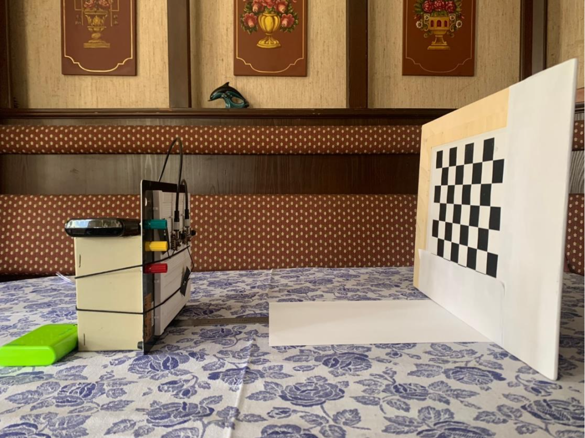
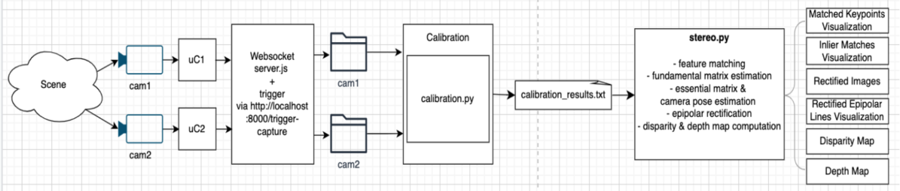

# 🎓 Experimental Journey in DIY Stereo Vision  
**Cost-Efficient Depth Map Generation with ESP32-Based Cameras**

---

## 🧠 Overview  
This project demonstrates a **low-cost stereo vision system** built using **two ESP32-S3 camera modules** to generate 3D depth maps.  
The goal was to make depth perception technology more accessible for **education, research, and robotics**, using affordable DIY hardware and open-source software.

---

## 🎯 Objectives  
- Configure a **synchronized dual ESP32-S3 camera setup** for stereo capture.  
- Develop **calibration** and **rectification** pipelines for accurate image alignment.  
- Implement **depth estimation** algorithms using OpenCV.  
- Evaluate the balance between **cost, performance, and computational constraints**.

---

## ⚙️ System Flow  

### 1. Hardware Setup  
Two **Xiao ESP32-S3** camera modules are mounted on a fixed baseline (7 cm and 9 cm tested) and powered independently via power banks.  
Both connect to a **local Wi-Fi network** for synchronized image capture and data transfer.  

### 2. Scene Capture (`CameraWeb.ino` / `app_httpd.cpp`)  
Each ESP32 runs custom firmware flashed via Arduino IDE.  
It initializes GPIO, Wi-Fi, and camera peripherals, then captures left and right images upon trigger.

### 3. Synchronization (`server.js`)  
A **Node.js WebSocket server** coordinates both cameras via a trigger endpoint:  http://localhost:8000/trigger-capture
When triggered, both cameras capture images simultaneously and send them to the server, which stores them in timestamped directories (`/cam1`, `/cam2`).

### 4. Calibration (`calibrate.py`)  
- Detects checkerboard corners using OpenCV.  
- Estimates **intrinsic** and **extrinsic** parameters.  
- Computes reprojection error for calibration accuracy.  
- Saves calibration data (`calibration_results.txt`) for later use.

### 5. Stereo Processing (`stereo.py`)  
- Uses **SIFT** and **AKAZE** algorithms for feature detection and matching.  
- Applies **RANSAC** filtering to remove outliers.  
- Rectifies images so epipolar lines are horizontally aligned.  
- Computes **disparity** and **depth maps** using block matching and geometric triangulation.  

### 6. Output  
The system outputs:  
- Matched keypoints  
- Rectified image pairs  
- Disparity heatmaps  
- Grayscale depth maps  

---

## 🧩 Key Challenges & Solutions  

| Challenge | Implemented Solution |
|------------|----------------------|
| **Camera Synchronization** | Software-based WebSocket triggering for simultaneous capture. |
| **Calibration Accuracy** | Iterative calibration via OpenCV and MATLAB, removing high-error image pairs. |
| **Depth Map Clarity** | Improved with AKAZE feature matching and increased baseline (9 cm). |
| **Hardware Instability** | Modular firmware design and error handling for network drops and resets. |
| **Limited Processing Power** | Optimized Python code and selective data handling to reduce computation load. |

---

## 📊 Results  
- Successfully generated **functional depth maps** from stereo ESP32-S3 cameras.  
- **9 cm baseline** produced higher calibration precision and better disparity consistency.  
- Demonstrated feasibility of stereo vision using **affordable, low-power hardware**.  

---

## 💡 Contributions  
- Developed a **fully integrated stereo vision pipeline** using ESP32, Node.js, and Python.  
- Proposed a **synchronization method** using WebSockets for Wi-Fi-based microcontrollers.  
- Created **calibration and disparity estimation** tools tailored to low-cost setups.  
- Validated that ESP32-based cameras can perform **3D depth sensing** with software optimization.  

---

## 🧰 Tech Stack  

| Category | Technologies |
|-----------|--------------|
| **Hardware** | 2× Seeed Studio Xiao ESP32-S3 Camera Modules |
| **Languages** | C++ (Arduino), JavaScript (Node.js), Python (OpenCV, NumPy) |
| **Frameworks** | WebSocket, HTTP Server, OpenCV |
| **Tools** | Arduino IDE, MATLAB, Visual Studio Code, macOS Terminal |

---

## 📷 Repository Structure  
Xiao_Stereo/
│
├── CameraWeb/ # ESP32 camera firmware (Arduino)
├── NodeServer/ # WebSocket server (Node.js)
│ ├── server.js
│ ├── client.html
│ └── styles.css
├── calibration.py # Stereo camera calibration
├── stereo.py # Disparity and depth estimation
├── calibration_results.txt # Stored camera parameters
├── images/ # Folder for figures and diagrams
│ ├── hardware_setup.jpg
│ └── pipeline_diagram.jpg
├── Faistauer_BachelorsThesis.pdf.zip
└── README.md

---

## 👩‍💻 Author  
**Isabela Faistauer**  
Bachelor of Science in Engineering – University of Applied Sciences Technikum Wien  
Supervised by Martin Stohanzl, MSc  

📍 Vienna, 2024  
📬 GitHub: [@saberblue909](https://github.com/saberblue909)

